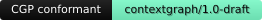

# Conformance registry

This page lists providers that are **Context Graph Protocol conformant** — green on
`contextgraph-conformance`'s suite for their declared capability set (see
[running-conformance.md](./running-conformance.md)) — with a reproducible,
checkable report backing the claim. It exists so "conformant" stays a
verifiable fact about a specific build, not a badge anyone can paste in.

Listings here are also load-bearing for governance: the freeze from
`contextgraph/1.0-draft` to `contextgraph/1.0` requires **at least two
independent implementations** passing the suite
([GOVERNANCE.md](../GOVERNANCE.md#the-path-to-contextgraph10)). This registry
is where that count becomes checkable.

## Conformant providers

| Provider | Author | Transport | Declared capabilities | Data flow | Protocol version | Last verified | Report |
|---|---|---|---|---|---|---|---|
| [`contextgraph-example-docs`](../contextgraph-conformance/src/bin/contextgraph-example-docs.rs) | Context Graph Protocol maintainers (bundled reference fixture) | stdio | `kinds=[doc, snippet]`, `graph`, `verify`, `correlation`, `embeddings_fingerprint=bge-small-en-v1.5/384/l2` | reads-only, `egress=false` (`local-only`) | `contextgraph/1.0-draft` | 2026-07-29 | 13/13 checks passed — [report](../site/public/registry/contextgraph-example-docs.report.json) |

This founding entry is the reference fixture bundled with
`contextgraph-conformance` itself (`SPEC.md` §11 seed providers) — it exists to
prove the table and the submission flow work end to end. Third-party
providers land the same way, via the PR flow below.

The listed report is a byte-for-byte capture of:

```bash
cargo install contextgraph-conformance
cargo build -p contextgraph-conformance --bin contextgraph-example-docs
contextgraph-inspect stdio --json -- ./target/debug/contextgraph-example-docs
```

(Run from a checkout of this repository, since `contextgraph-example-docs` is
a dev-only fixture binary, not something published to crates.io — see the
`publish = true` override note in `contextgraph-conformance/Cargo.toml`.)

## How to get listed

There is no submission form and no self-attestation — a listing is a pull
request that a maintainer can independently re-run.

1. **Run the suite against your provider** with `contextgraph-inspect ... --json`
   (see [running-conformance.md](./running-conformance.md)) and confirm every
   check is `pass` (a `skip` is fine — e.g. `malformed-input-tolerance` on an
   HTTP or in-process target — a `fail` is not).
2. **Open a pull request** adding one row to the table above and, if it's
   convenient to share, the JSON report file it links to. State the exact
   command you ran — the PR template has a **Registry submission** checklist
   item for this; a listing with no reproducible command attached will not be
   merged.
3. **Add the badge** (optional, see below) to your own README once the PR
   merges.

A maintainer re-runs the check before merging. A listing that stops passing —
because the provider regressed or the protocol moved — gets a follow-up PR to
fix it or remove the row; this registry is a live claim, not a one-time
certificate.

## The badge

Once your provider has a merged row in the table above, you can put this in
your own README:

```md

```

which renders as:



The badge is a static, hand-authored asset — not a live third-party redirect —
so it never depends on this site's uptime and never phones home. It names the
protocol family the badge claims (`contextgraph/1.0-draft`), not a specific
provider version; the row in this table is what backs the specific claim.
